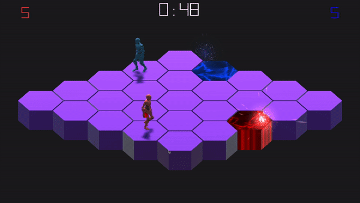
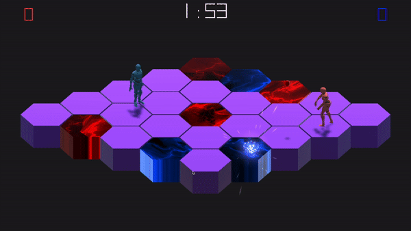
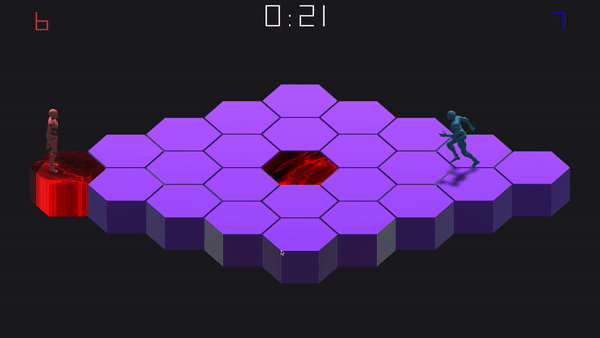
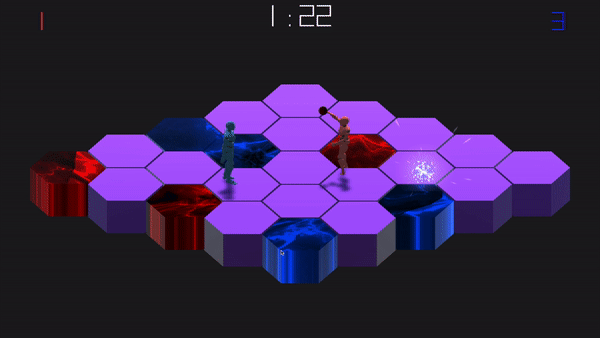

# Battle Balls
Battle Balls is a local PVP game where players throw balls to claim territory on the game's hexagonal grid. Points are won by hitting the opponent or by forcing the opponent to step on one's claimed territory. Battle on!

